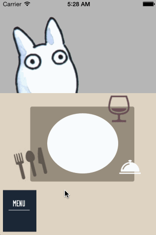

Homework-4
==========
Using custom gestures part 2

KNOWN ISSUES:

- Some slight bugginess with interactions in certain use cases, could use massaging
- Could not save & set image from camera

STORIES COMPLETED:

Implement scrollable tray of images

You should be able to drag the tray up or down.

Once the tray is revealed, you shouldn't be able to drag it any more.

After releasing the tray, it should either move to its hidden position or its revealed position.

Dragging an image from the tray should create a new copy of the image which can be dragged into the canvas area.

Pinching images in the canvas area should resize them

Other:
- Fruit is still draggable after it's been dropped onto canvas

OPTIONALS:
- Allow the user to rotate the image
- Tapping the camera icon opens the camera (no camera detected on my device so I made it open to photo album)

Not Completed: 
After taking a picture, the picture is added to the view as a background view 
(translated a section of iOS code I found and logic seems to make sense, no errors in editor, but still doesn't quite run)

Other:
- Amount / size of food tracked into a score used to trigger dynamic feedback & animation
- Clearing of all new elements from screen with a click of a button

